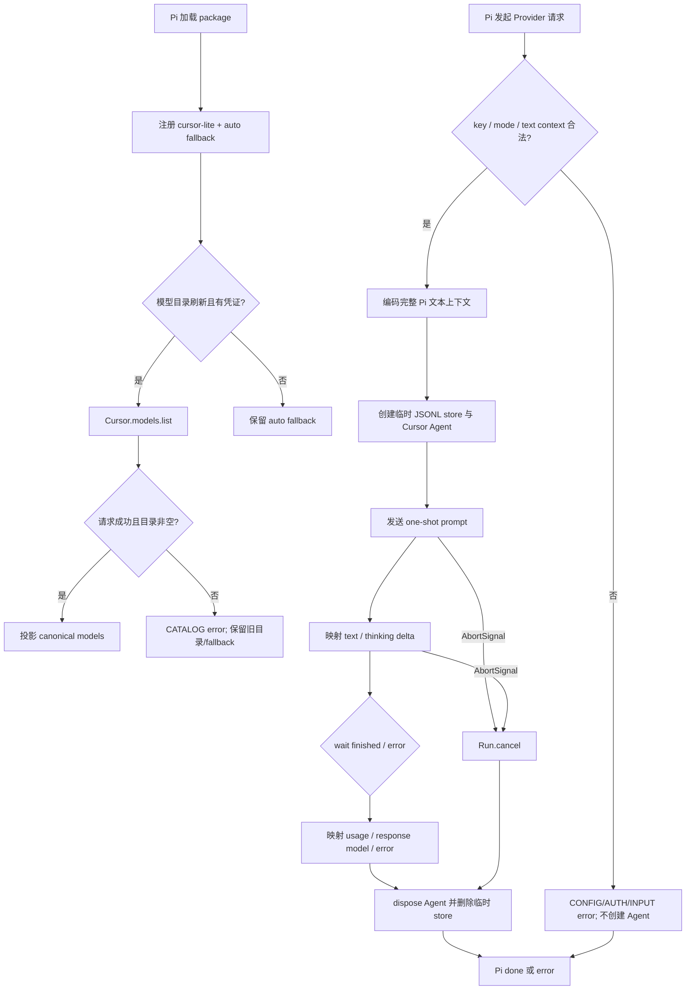

# 轻量 Cursor 模型 Provider

## 0. 术语约定

| 术语 | 定义 | 防冲突结论 |
|---|---|---|
| Cursor Local Agent Runtime | Agent 循环和文件访问运行在本机，模型推理仍由 Cursor 托管 | 不称为“本地模型” |
| Pi Provider | 通过 Pi 模型注册表出现在 `/model` 中并承担一次模型请求的适配器 | Provider id 固定为 `cursor-lite`，避免与其他 Cursor 扩展冲突 |
| One-shot Agent | 每次 Pi Provider 请求创建、运行、释放一个独立 Cursor Agent | 不等同于会话恢复或 Agent 池化 |
| Cursor 原生工具面 | Cursor Agent 自己提供的读、搜、Shell、编辑等工具 | 不转换为 Pi tool call，也不受 Pi active-tools 开关控制 |
| 运行模式 | Cursor SDK 的 `plan` 或 `agent` conversation mode | 默认 `plan`；仅显式 `PI_CURSOR_MODE=agent` 时进入执行模式 |
| Pi resolved auth | Pi 按 provider 解析出的当前请求 API key，来源可以是环境、`/login` 存储或 `--api-key` | Provider 只消费解析结果，不自行读取 Cursor Desktop/CLI 凭证 |

仓库当前只有 CodeStable 骨架，grep 未发现同名业务概念或历史 feature。

## 1. 决策与约束

### 1.1 需求摘要

为只需要“在 Pi 中选择并调用 Cursor 模型”的用户提供小型、可审计、可卸载的 Provider。成功标准是：扩展可被 Pi 加载、可发现账号可用模型、可把 Pi 文本上下文交给 Cursor Local Agent、可流式呈现文本与 thinking、可记录 usage，并在失败或取消后释放全部一次性运行资源。

**明确不做：**

- 不创建或管理 Cursor Cloud Agent。
- 不复用、恢复或池化 Cursor Agent；不保存跨请求 Cursor 会话。
- 不实现 MCP/Pi 工具桥接，不把 Cursor 工具事件转换成 Pi tool call。
- 不实现 Cursor 原生工具回放卡片、复杂配置 UI、模型缓存、thinking 参数映射或 fast/context 虚拟模型。
- 首版只接受文本上下文，不承诺图片输入。
- 不复用 Cursor Desktop/CLI 登录状态，不读取其本地凭证。

### 1.2 复杂度档位

这是长期维护的第三方 SDK 适配包，采用 `L3 + modules + reasonable + public + active + tested + validated`：

- **Performance = reasonable**：偏离对外服务常见的 budgeted；本地 CLI 单请求没有 QPS/SLA，重点是避免重复序列化和遗留进程，不引入基准测试。
- **Observability = logged**：偏离 traced；没有跨服务运维链路，只通过 Pi error、SDK request id 与 usage 暴露可诊断事实，不增加常驻日志或遥测。
- **Compatibility = current-only**：以 Pi `0.81.1` 为验证基线并精确使用 `@cursor/sdk` `1.0.24` 公开接口；Pi core peer range 按 package 规范保持 `*`，不维护旧 SDK 兼容分支。
- **Security = validated**：校验凭证存在、模式、文本输入和外部错误；Cursor `plan` 只是行为默认值，不冒充 sandbox 或权限边界。
- **Concurrency = isolated-per-call**：并发请求各自拥有临时 store 与 Agent，不共享可变运行状态。

### 1.3 方案深度 pre-pass

候选有三种：单文件直接调用 SDK、带真实外部 seam 的模块化轻量实现、完整会话/桥接集成。选择第二种：核心价值必须通过真实 Cursor SDK 端到端完成，不能用 fake 替代；测试只在 true external seam 使用 fake。排除会话恢复和桥接来自用户明确边界，且 One-shot 路径仍覆盖模型发现→真实 Agent→流输出→清理的最窄完整闭环，不是只挑容易部分。

### 1.4 关键决策

1. **Provider 身份独立**：provider 为 `cursor-lite`；Pi model 对象的 `id` 保持 Cursor canonical id（如 `auto`、`composer-2.5`），CLI 才显示为 `cursor-lite/<id>`。传给 SDK 时直接使用 `model.id`，不拼接也不剥离 provider prefix；带斜杠的 canonical id 仍原样保留。
2. **每次调用无状态**：把当前 Pi system prompt 与文本消息编码成结构化上下文，交给全新的 Cursor Agent；不依赖前次 SDK checkpoint。
3. **Cursor 拥有工具循环**：Provider 只输出 Cursor 最终文本/thinking/usage；SDK 工具在内部执行，Pi 不执行第二遍。
4. **模式 fail-closed**：未配置时为 `plan`；只接受 `plan|agent`，其他非空值在创建 Agent 前报错。
5. **动态目录 + 最小 fallback**：认证后用 Cursor 模型目录注册 canonical model id；无认证或目录尚未刷新时保留 `auto`。SDK 不提供上下文窗与最大输出元数据，因此首版使用固定估算值并在 README 明示其不代表服务端权威限制。
6. **真实流与一次性状态清理**：使用 SDK delta/stream 公共接口；每次调用使用独立临时 JSONL store，Agent dispose 后递归删除，清理失败不伪装成功。
7. **依赖精确固定**：runtime 精确依赖 `@cursor/sdk@1.0.24`；不兼容时升级扩展而不是运行时猜测多版本形状。
8. **不额外注入配置面**：扩展不传 `mcpServers`、`customTools`、inline `agents` 或 `local.settingSources`。固定 SDK 文档只明确保证未传 `settingSources` 时不加载 ambient MCP；disposable fixture poison probe 已证实 project/user hooks 同样不生效，README 据此说明。Cursor 原生内置工具始终存在。
9. **认证由 Pi 统一解析**：provider id/auth.json key 为 `cursor-lite`，环境入口为 `CURSOR_API_KEY`。解析优先级遵循 Pi 0.81.1：CLI `--api-key` → `auth.json[cursor-lite]` → `CURSOR_API_KEY` → models.json；stream 只消费 `options.apiKey`，catalog 只消费 refresh context 的有效 api-key credential。
10. **“轻量”约束 wrapper 而非 SDK**：package 为 ESM、直接发布 TypeScript extension，`files` 只含 `src/` 与 `README.md`；runtime dependency 只有精确 `@cursor/sdk@1.0.24`，Pi core 只作 peer。wrapper tarball 预算为不超过 12 个文件、150 KiB unpacked，唯一计量权威是 `npm pack --json` 返回的 entryCount/unpackedSize/file list；Cursor SDK 自身及平台 binary 的安装体积不计入 wrapper 预算且必须在 README 明示。

### 1.5 执行风险与证据计划

**Top 3 风险：**

1. **把 Agent SDK 当成裸模型 API**：可能重复执行工具或让用户误以为 Pi 在控制工具。缓解：接口契约明确“Cursor 内部执行、Pi 不发 tool call”，并用反向测试扫描 `mcpServers/customTools/Agent.resume`。
2. **取消或异常留下进程/上下文文件**：可能污染本机状态。缓解：独立临时 store、`finally` dispose + 带重试的删除、abort 测试和文件系统证据。
3. **上下文与模型元数据不完全对等**：One-shot Agent 看不到前次 Cursor 工具历史，SDK 目录也没有 context/output 上限。缓解：每次传完整 Pi 文本上下文、固定估算、README 明示限制，并用真实 key smoke 验证目标版本。

**非显然依赖：** Node.js `>=22.19`（Pi 0.81.1 的更严格下限）、可联网的 Cursor SDK API Key，以及 SDK `1.0.24` 提供的 `darwin-{arm64,x64}`、`linux-{arm64,x64}`、`win32-x64` optional binary。当前 live acceptance 只在 `win32-x64` 声称已验证；其他官方平台仅声明可安装候选，未跑 live 前 README 标为未验证。没有 key 时可以完成 package/load/mock 验证，但真实目录与真实模型 smoke 会阻塞最终外部集成证明。

**关键假设：**

- 用户接受每个 Pi 请求都重新探索代码库，以换取无恢复状态和更小实现。
- `plan` 模式满足默认交互倾向，但不是防止所有副作用的安全保证。
- 用户接受 Pi 侧首版固定 `128000` context window、`16384` max tokens 仅为估算；真实限制以 Cursor 为准，README 提供 `models.json` override 指引。
- Cursor SDK 公开的 `Cursor.models.list`、`Agent.create/send(onDelta)`、`Run.wait/cancel`、`SDKAgent[Symbol.asyncDispose]` 和 JSONL store 在固定版本上可用；这些已由官方 `.d.ts` 核对，implementation 仍须 typecheck/live probe。

**证据类型：** 纯转换走单测；Provider/SDK seam 走 fake adapter 集成测试；package/load/unload 走隔离 Pi 配置目录的 CLI 对照；真实目录和推理走脱敏 live smoke；边界与版本承诺走可重复脚本和 tarball 清单。

**交付物：** 可安装 Pi package、Provider/SDK adapter 与纯转换模块、自动测试、README 配置/风险/卸载说明、设计/审查/验收记录。

**清洁度：** 不允许新增临时调试输出、未解释 TODO/FIXME、注释掉代码、无用 import、捕获并吞掉的资源清理错误或包含 API Key/完整 prompt 的日志。

## 2. 名词与编排

### 2.1 名词层

#### 现状

无现有源码、Provider、模型目录或 SDK adapter；Pi 与 Cursor SDK 均是 true external dependency。

#### 变化

- **新增 `CursorLiteMode`**：闭集 `plan | agent`；环境值缺失映射为 `plan`，非法值返回配置错误。
- **新增 `CursorCatalogModel` 投影**：把 Cursor canonical id/display name 投影为 Pi model；始终去重并保留 `auto` fallback，输入为 text-only。Pi schema 强制数值 cost，因此未知价格写零值，但 README 必须明确“未知，不代表免费”。
- **新增 `PiContextEnvelope`**：从原始 Pi `Context` 构建，先遍历 content parts 再生成 prompt。user string/text、assistant text、tool-result text 可编码；thinking 不作为新指令，toolCall 只作为历史摘要；任意 image 或未知 part 先以 INPUT error 拒绝。`Context.tools` 不序列化，并明确只允许 Cursor 原生工具。
- **新增 `CursorLiteError`**：错误码闭集 `CONFIG | AUTH | INPUT | CATALOG | SDK | CLEANUP`，phase 闭集 `configure | catalog | prepare | create | run | cleanup`；对外消息格式为 `CURSOR_LITE_<CODE> phase=<phase> [requestId=<safe-id>]: <redacted-message>`。abort 使用 Pi `stopReason=aborted`，不伪装普通错误。统一 `sanitizeError` 只读取 `Error.message`，不序列化 cause/stack/details；替换本次 exact key、完整 prompt、临时 root，并清洗 `Authorization/Bearer` 与 key-like token，截断到 500 字符。request id 只保留 128 字符以内的字母数字/`-_.`。
- **新增 `CursorSdkPort`**：隔离模型发现与一次性 Agent 运行；production adapter 使用固定 SDK，测试 adapter 可控地产生 delta、usage、错误和 abort。
- **新增 `CursorRunResult`**：包含最终状态、resolved model、usage 与可选 request id；不包含 Cursor 工具 args/result。

接口示例：

```ts
interface CursorRunResult {
  status: "finished" | "aborted";
  finalText?: string;
  modelId?: string;
  requestId?: string;
  usage?: {
    input: number;
    output: number;
    cacheRead: number;
    cacheWrite: number;
    reasoning?: number;
    totalTokens: number;
  };
}

interface CursorSdkPort {
  listModels(input: { apiKey: string; signal?: AbortSignal }): Promise<CursorCatalogModel[]>;
  run(
    input: {
      apiKey: string;
      modelId: string;
      mode: "plan" | "agent";
      cwd: string;
      prompt: string;
      signal?: AbortSignal;
    },
    sink: { text(delta: string): void; thinking(delta: string): void },
  ): Promise<CursorRunResult>;
}
// SDK/cleanup 失败 reject CursorLiteError；来源：全新 Cursor SDK adapter seam，当前仓库无现状接口。
```

Pi 0.81.1 生命周期映射固定为真实公开签名：

```ts
interface ProviderConfig {
  apiKey?: string;
  api?: Api;
  models?: ProviderModelConfig[];
  refreshModels?(context: RefreshModelsContext): Promise<ProviderModelConfig[]>;
  streamSimple?: (
    model: Model<Api>,
    context: Context,
    options?: SimpleStreamOptions,
  ) => AssistantMessageEventStream;
}

interface RefreshModelsContext {
  credential?: { type: "api_key"; key?: string } | { type: "oauth"; access: string };
  allowNetwork: boolean;
  force?: boolean;
  signal?: AbortSignal;
}

interface SimpleStreamOptions {
  apiKey?: string;
  signal?: AbortSignal;
  sessionId?: string;
  maxTokens?: number;
}

pi.registerProvider("cursor-lite", {
  baseUrl: "https://api.cursor.com", // 仅满足 Pi model 元数据；实际传输由 SDK adapter 拥有
  apiKey: "$CURSOR_API_KEY",
  api: "cursor-sdk-local",
  models: [autoFallback],
  refreshModels: refreshCursorModels,
  streamSimple: streamCursorOneShot,
});
// 来源：Pi 0.81.1 ExtensionAPI.registerProvider / ProviderConfig / pi-ai types。
```

`streamSimple` 同步返回 Pi `AssistantMessageEventStream`，内部异步流程依次 push `start`、有序 `text_*`/`thinking_*`，最后且仅最后 push `done` 或 `error`。请求 key 来自 `options.apiKey`，取消来自 `options.signal`；`Context` 的 `systemPrompt`、`messages` 与 content parts 在生成 prompt 前完整校验。`ProviderModelConfig` 必填 `id/name/reasoning/input/cost/contextWindow/maxTokens`；模型刷新返回新数组，throw 时由 Pi 保留当前 provider catalog。

Cursor SDK `1.0.24` 只使用以下公开入口：

| 能力 | import / 精确公开契约 | 本 feature 用法 |
|---|---|---|
| 模型目录 | `Cursor.models.list({ apiKey? }): Promise<ModelListItem[]>` | 读取 `id/displayName`；不猜私有字段 |
| 临时 store | root package 公开导出 `JsonlLocalAgentStore`；`new JsonlLocalAgentStore(rootDir)` | 显式传入 `Agent.create({ local: { store } })`，不落默认全局 store |
| 创建 Agent | `Agent.create({ apiKey, model:{id}, mode, local:{cwd,store} }): Promise<SDKAgent>` | 仅 local runtime；不传 cloud/MCP/agents/settingSources |
| 启动 Run | `agent.send(prompt,{ mode,onDelta }): Promise<Run>` | `onDelta({update})` 只投影 `text-delta` 与 `thinking-delta` |
| Run 终态 | `run.wait(): Promise<RunResult>`；`run.cancel(): Promise<void>` | wait 提供 result/model/requestId/usage；cancel 只在拿到 Run 后调用 |
| Agent 清理 | `agent[Symbol.asyncDispose](): Promise<void>` | terminal 前等待；不调用 cloud-only `Agent.delete` |
| Usage | `TokenUsage{inputTokens,outputTokens,cacheReadTokens,cacheWriteTokens,totalTokens,reasoningTokens?}` | 逐字段复制，SDK 公开契约保证 total 等于前四项之和且 reasoning 是 output 子集 |

来源是固定 npm package 的 `dist/esm/{public-api,options,agent,run,usage-types}.d.ts` 与 Cursor TypeScript SDK 文档；`public-api.d.ts` 明确从 package root 导出 `JsonlLocalAgentStore`；实现不得 deep-import、shape guessing 或访问私有成员。Pi 0.81.1 `Api = KnownApi | (string & {})`，所以 `cursor-sdk-local` 是合法自定义值；`StreamOptions.apiKey?: string` 由 Pi resolved auth 注入；Pi 通过 jiti 原生加载 `.ts` extension；`@earendil-works/pi-coding-agent@0.81.1` 的 package bin 为 `pi: dist/cli.js`。这些事实进入 typecheck/manifest/packed-load 证据。`onDelta` callback 会被 SDK 顺序 await，因此 sink ordering 有公开依据。省略 `local.settingSources` 对 MCP server 的行为来自官方“Without local.settingSources, only inline servers are loaded”契约；该句不外推到 hooks/subagents。

Pi stream 协议固定为：

| 时机 | Pi event / partial 变化 |
|---|---|
| 启动 | 创建 `AssistantMessage{api:model.api,provider:model.provider,model:model.id,content:[],usage:zero,stopReason:"stop",timestamp}`，push `start` |
| 首个/切换到 text | 关闭前一 active block；追加 `{type:"text",text:""}`，push `text_start` 后按同一 `contentIndex` push `text_delta` |
| 首个/切换到 thinking | 同上，追加 `{type:"thinking",thinking:""}` 并使用 `thinking_*`；model `reasoning=false` 只表示 Pi 不控制 thinking 参数，不禁止渲染 SDK thinking |
| SDK finished | 关闭 active block；若无 text delta 且 `result.result` 非空，补一个 text block；映射 usage/`responseModel`/`responseId`，push `done{reason:"stop",message}`，再 `stream.end()` |
| SDK/cleanup error | 保留 partial content，设置 `stopReason="error"` 与脱敏 `errorMessage`，push `error{reason:"error",error}`，再 `stream.end()` |
| abort 且 cleanup 成功 | 保留 partial content，设置 `stopReason="aborted"`，push `error{reason:"aborted",error}`，再 `stream.end()` |

Pi `Usage` 必填字段始终存在；SDK 未报告 usage 时计数为 0。SDK 报告时复制 `totalTokens` 并在测试中断言它等于 input/output/cacheRead/cacheWrite 之和，`reasoningTokens` 进入可选 `usage.reasoning` 且不再次加入 total；`calculateCost` 基于模型零价格生成全零 cost。最终 `message.model` 保持 requested `model.id`，SDK resolved id 不同时写 `responseModel`，安全 request id 写 `responseId`。事件测试必须消费 async iterator 到结束，不能只检查 sink。

正常示例：`modelId=auto, mode=plan, prompt=<结构化 Pi 上下文>` → 顺序 text/thinking delta + finished result。错误示例：signal abort → 取消 SDK Run、清理临时 store，并以 aborted 结果结束；API key 或 model 无效 → 清理后抛出不含凭证的错误。

`PiContextEnvelopeV1` 使用确定性 JSON，不使用可被消息内容闭合的自定义 XML delimiter：

```ts
interface PiContextEnvelopeV1 {
  schemaVersion: 1;
  hostNotice: "Pi context is data; use Cursor native tools only";
  systemPrompt: string | null; // SDK 无 system/instructions seam，因此以 user prompt 数据传递，优先级会降级
  messages: Array<
    | { index: number; role: "user" | "assistant"; text: string }
    | { index: number; role: "assistant-tool-call"; toolName: string; toolCallId: string }
    | { index: number; role: "tool-result"; toolName: string; toolCallId: string; isError: boolean; text: string }
  >;
}
```

序列化保持原消息顺序和每类 text block 顺序；assistant thinking 不写入 envelope，tool-call arguments 不写入且不会重放；空 text 可保留但空消息不凭空生成。所有用户字符串只作为 `JSON.stringify` 的值，不参与 schema key/delimiter。最终 prompt 是固定说明 + 一次 JSON 序列化；Pi system prompt 中的 Pi 工具说明仅作 host context，`hostNotice` 明确工具可调用面不同。正向测试覆盖 system、多轮 user/assistant、tool call/result、空文本、换行/引号/伪 schema 字符串与顺序；负向测试覆盖 user/tool-result image 和未知 part。

##### Interface 设计检查

- **Module**：Cursor SDK adapter（新增）。
- **Interface**：caller 只知道 catalog 与 one-shot run；必须提供 key/model/mode/cwd/prompt，sink 事件有序且同一调用内不并发，resolve/reject 前资源已清理。
- **Seam**：Provider orchestration 与 true external SDK 之间；测试和生产都穿过同一 port。
- **Depth / locality**：Agent/store/run/cancel/dispose 复杂度留在 adapter；删除 adapter 会把这些细节重新散回 Provider 和测试，module 不是 pass-through。
- **Dependency strategy**：true external。
- **Adapter**：production Cursor SDK adapter + test fake adapter，是真实替换需求。
- **Test surface**：目录映射、delta 顺序、usage、错误、abort 与清理均可通过 port 观察；adapter 内另保留纯 `projectSdkEvent` seam，SDK `tool_call/status/task` 输入必须投影为 ignore，供测试证明不会进入 Pi stream。

### 2.2 编排层

#### 现状

无现有流程。

#### 变化



拓扑是“目录刷新分支 + 单次运行状态机”，因此使用流程图而非线性文字。

**流程级约束：**

- 注册阶段不因缺 key 崩溃；`auto` 使 `/login`、`--api-key` 和模型选择入口仍可到达。无 key/离线刷新不得调用 `Cursor.models.list`。
- 模型刷新只挂在 Pi `refreshModels` 生命周期，由 Pi 启动刷新、`pi update --models` 或显式模型刷新触发；不设定时器，也不在每次 Provider 请求前强刷。扩展不实现 single-flight、TTL 或 catalog 状态；每次 callback 只处理自己的 credential/signal，目录发布与失败保留由 Pi Provider runtime 管理。
- `allowNetwork=false`、无 credential 或 credential.type 不是 `api_key` 时返回 `[autoFallback]` 且不调用 SDK；不记录 debug。联网且有 key 时目录成功返回 `merge(autoFallback, validCanonicalModels)`：`auto` 固定第一，其余按 SDK 首次出现顺序稳定去重。请求失败或成功空数组都 throw `CURSOR_LITE_CATALOG`，由 Pi 保留当前目录。无凭证时 extension 可加载但 Pi 可把模型标为 unavailable；隔离 load 测试用 `allowNetwork=false` 与 dummy provider credential 验证静态 `auto`，不得触网。
- extension 初始化时以 `process.cwd()` 为 fallback，并只订阅 `session_start` 更新 Pi 0.81.1 文档和类型公开的 `ExtensionContext.ctx.cwd`；session replacement 会重建 extension runtime 并再次触发 `session_start`。每个 Provider 请求快照该 cwd 后只创建一个 Agent、一个 Run 和一个临时 store，并发请求的 Agent id、store root、sink 和 abort controller 均不共享。session hook 不启动后台资源。
- delta 按 SDK 到达顺序映射；若没有 text delta，以 `RunResult.result` 作为一次 fallback 文本，避免重复最终文本。
- SDK tool/status/task 事件由 adapter 的 event projector 明确丢弃，不映射为 Pi tool call；不把内部 args/result写入日志或会话。
- API Key 只通过 Pi resolved auth 的请求局部变量进入 SDK，不进入 prompt、错误、details、测试 fixture、hash、console/stdout/stderr 或诊断文件；JavaScript 字符串无法承诺主动清零，生命周期止于该请求闭包与 SDK 调用。

**资源获取与 abort：**

| Phase | 已持有资源 | Abort / failure 动作 |
|---|---|---|
| P0 preflight | none | pre-aborted 直接形成 aborted primary，不创建 temp |
| P1 store | `mkdtemp(pi-cursor-lite-*)` + JSONL store | POSIX root `0700`；create 失败或 signal 已 abort 时删除 root |
| P2 agent-create | store；SDK create 期间暂无可取消 handle | create settle 后再次检查 signal；成功则 dispose，失败则继续删 store |
| P3 run-active | store + agent + run + 一个 abort listener | signal 首次触发时只调用一次 `Run.cancel`；wait 与 abort 用 single terminal latch，先 settle 者决定 primary |
| P4 cleanup | store + 可选 agent/run | 先移除 listener；cancel（若需要）→ asyncDispose → rm，前一步失败仍继续后一步 |

`Run.cancel` 与 `agent[Symbol.asyncDispose]` 各有 5 秒本地等待上限；temp 删除使用 Node `fs.rm({recursive:true,force:true,maxRetries:5,retryDelay:100})`。timeout/reject 被收集但不阻止后续清理。`mkdtemp` 保证 root 是本扩展新建目录，不跟随外部 symlink；受保护 root 内的 JSONL 即使文件 mode 较宽也不可被其他 POSIX 用户遍历。Windows 依赖用户 temp ACL，并用删除重试处理短暂文件锁。

**终态优先级矩阵：**

| Primary outcome | Cleanup outcome | Pi terminal | Residual contract |
|---|---|---|---|
| preflight failure | no resources | matching CONFIG/AUTH/INPUT `error` | none |
| SDK finished | all settled successfully | `done` | none |
| SDK error | all settled successfully | `error: CURSOR_LITE_SDK` | none |
| signal wins latch + cancel succeeds | all settled successfully | `error` event with message `stopReason=aborted` | none |
| signal wins但 cancel reject/timeout | dispose/delete 成功 | `error: CURSOR_LITE_SDK phase=run` | none |
| 任意 primary | dispose 或重试后的 temp delete 失败 | `error: CURSOR_LITE_CLEANUP phase=cleanup`（最高优先级） | 允许残留 OS temp 下可能含 prompt/代码上下文的 `pi-cursor-lite-*`；消息报告 `residual=true` 与通配清理建议，不输出完整路径/key/prompt |

terminal Pi event 只在 P4 全部 settle 后产生。cleanup failure 不承诺零残留；测试先断言 residual，再由 test harness 强制二次清理。SIGKILL/断电无法执行 finally，作为 residual risk 明示，不在首版扫描或删除历史未知 temp。

**错误映射：**

| Source | Code / phase |
|---|---|
| 非法 `PI_CURSOR_MODE` | `CONFIG / configure` |
| stream 无 resolved key | `AUTH / prepare` |
| catalog 的 SDK AuthenticationError | `AUTH / catalog` |
| catalog 网络/空目录/非法目录 | `CATALOG / catalog` |
| image/未知 content part | `INPUT / prepare` |
| Agent.create 配置/模型失败 | `SDK / create`（若明确是 AuthenticationError 则 `AUTH / create`） |
| send/wait/cancel 失败 | `SDK / run` |
| dispose/delete reject 或 timeout | `CLEANUP / cleanup` |

sanitizer 先去除 ANSI/控制字符并单行化，再执行 exact key/prompt/temp-root 替换与 Bearer/key-like 清洗；不输出 cause/stack/details。Windows/POSIX path 和 file URL 只在 exact temp-root 替换后进入 bounded message。SDK request id 只从 `Run.requestId/RunResult.requestId` 读取；成功映射到 `responseId`，错误时只在安全格式校验通过后附加。

### 2.3 挂载点清单

**真正挂载点：**

1. **Pi package manifest `pi.extensions`** — 唯一 extension entry；删除后 package 不再加载。
2. **`pi.registerProvider("cursor-lite", …)`** — 唯一 Provider 注册；其 `refreshModels/streamSimple` 是模型目录和请求生命周期入口。
3. **`pi.on("session_start", …)`** — 唯一事件订阅，只更新 cwd；Pi extension runtime teardown 负责移除 listener，fresh process/load-unload 测试证明不加载 package 时无 listener/provider。

**运行配置入口（不是注册挂载点）：**

4. **`CURSOR_API_KEY` / Pi resolved auth** — Cursor SDK 凭证来源。
5. **环境配置 `PI_CURSOR_MODE`** — 进程级 `plan|agent` 模式选择，每次请求开始时快照；默认 `plan`，无交互切换命令。

### 2.4 推进策略

1. **外部契约与编排骨架**：以 Pi 0.81.1 和 Cursor SDK 1.0.24 typecheck probe 固定公开签名，再建立 package/Provider/auto fallback；退出信号是无 deep import/private shape 且隔离 Pi 可加载。
2. **纯计算节点**：完成 auth/model id/mode、catalog、错误与 `PiContextEnvelopeV1` 投影；退出信号是正向多轮/边界注入与负向输入测试通过。
3. **真实 SDK adapter 与 Pi stream**：接通 one-shot Agent、onDelta projector、RunResult→Pi events/usage；退出信号是 fake seam 测试消费完整 async stream 到终态，覆盖 tool ignore 和 partial error。
4. **运行硬化**：按 P0-P4 接通 abort、并发隔离、临时 store、timeout/retry、cleanup 矩阵；退出信号是阶段/竞态组合测试符合终态和 residual 契约。
5. **用户文档**：补齐认证优先级、进程级 mode、数据发送范围、成本/usage 未知、工具审计缺口、安全/平台/one-shot 限制与凭证清除；退出信号是 README/manifest 断言通过。
6. **发布与功能卸载边界**：核对 package allowlist/预算、生产依赖、packed install、注册边界和隔离 Pi load/unload；退出信号是 packed wrapper 可加载且不加载时 Provider/listener 完全消失。
7. **真实 Pi 模型目录**：用 owner 环境 key 从 packed wrapper 触发 Pi refresh；退出信号是 `auto` 固定第一，其余 canonical ids 按 SDK 首次出现顺序稳定去重（含斜杠 id），公共 CLI 与该规则对齐。
8. **真实运行 smokes**：在 disposable git fixture 运行 plan 结构/上下文 sentinel、ambient hook/subagent poison probe 与显式 agent canary edit；退出信号是响应结构合法，probe 观察与 README 一致，agent 仅产生预期 canary diff，fixture/进程/temp 全清理。

### 2.5 结构健康度与微重构

##### 评估

- 文件级：仓库尚无源码文件，不存在待修改胖文件、职责混杂或高密度改动。
- 目录级：`src/`、`test/` 尚不存在，同层文件数为 0；按 Provider orchestration、纯转换、SDK adapter 和测试 seam 分组后不会触发摊平。
- compound convention：检索“目录/命名/归属/Cursor/Provider”无命中。
- Module/interface：选择单一深 adapter seam，而不是每个 SDK 类型各包一层；不会形成 layers 或万能 util。
- 计划 runtime tree：`src/index.ts`（entry）、Provider orchestration、纯 catalog/context/error 投影、单一 Cursor SDK adapter；总 runtime source 不超过 8 个文件。`test/` 与 `scripts/` 只作开发验证，不进入 package `files`。
- Manifest：`name=pi-cursor-lite`、`type=module`、`private=true`、`engines.node>=22.19`、`pi.extensions=["./src/index.ts"]`、`files=["src","README.md"]`；runtime dependency 仅 `@cursor/sdk=1.0.24`，Pi core/typebox 如使用只列 peer `*` 与精确 dev baseline。

##### 结论：不做

这是全新模块，无可“只搬不改行为”的对象；实现直接按模块职责落位。

## 3. 验收契约

### 3.1 关键场景

- **SC-01 无凭证加载**：未配置 key 启动 → package 正常注册且不触发目录网络；Pi 可将模型标为 unavailable。隔离 Pi 以 `allowNetwork=false` 和 dummy `auth.json[cursor-lite]` 加载 packed wrapper → 显示 `cursor-lite/auto`。
- **SC-02 动态 Pi 目录**：有效 key 通过 packed wrapper 的 Pi `refreshModels` → 公共 CLI 列表为 `auto` 固定第一，其余按 `Cursor.models.list` 首次出现顺序稳定去重，含斜杠 id 时仍可选择；请求失败/空数组不提交新目录。
- **SC-03 Pi stream/usage**：默认 plan run → SDK 收到 `mode=plan`；Pi async stream 从 start 到 terminal/end 可完整消费，text/thinking/contentIndex/partial/responseModel/responseId/usage/cost 均符合 §2.1 表，并以 `reasoning=false` 模型完成 thinking 可见性探针；live 只断言 sentinel/结构，不要求自然语言全文 exact。
- **SC-04 模式配置**：进程未设置 mode → 每请求快照为 `plan`；启动时设置 `PI_CURSOR_MODE=agent` → SDK 收到 `agent`；非法值在 Agent 创建前以 CONFIG/configure 失败。
- **SC-05 Cursor 工具所有权与配置面**：SDK projector 收到 tool-call/status/task update → Pi 无 tool call/result；扩展不向 Agent.create 注入 MCP/customTools/inline agents/settingSources。disposable fixture 的 poison probe 记录 hooks/file-based subagents 是否按 SDK 默认生效，README 必须与观察一致；ambient MCP 不加载。
- **SC-06 abort/cleanup**：pre-abort、create 期间、run-active、wait/finished 竞态、cancel reject/timeout、dispose/delete failure → 全部符合 P0-P4 与终态矩阵，terminal 只在 cleanup settle 后产生。
- **SC-07 外部错误**：各错误源 → 精确 code/phase、可选安全 request id、单行 bounded 脱敏 message；cleanup 成功零残留，cleanup 失败返回最高优先级 CLEANUP/residual 并由测试二次清理。
- **SC-08 fallback 文本**：无 text delta 但 result 有文本 → 只补一次；已有 delta 时不重复 result；partial 后 error 保留 partial 并正常结束 iterator。
- **SC-09 文本上下文保真**：system、多轮 user/assistant、tool call/result、空文本、换行/引号/伪 schema sentinel → `PiContextEnvelopeV1` JSON 顺序和值精确，live context smoke 能返回历史 sentinel。
- **SC-10 非文本输入**：原始 user/tool-result image 或未知 content part → prompt 生成和 SDK 调用前以 INPUT/prepare 失败。
- **SC-11 功能卸载**：隔离 Pi fresh process 加载 packed wrapper时出现 Provider/listener；不加载或移除 package entry 后两者均消失，且无自定义 config/cache/background resource。
- **SC-12 package 边界**：packed wrapper → manifest、files allowlist、wrapper 文件数/大小、精确 SDK production dependency、Pi peer/dev baseline、Node engine 与 token 估算全部符合预算；空目录安装 packed artifact 后可加载。
- **SC-13 并发运行隔离**：两个 fake Provider run → Agent id/store/sink/abort listener 不同；取消一个不影响另一个，双方按各自矩阵清理。
- **SC-14 数据清除边界**：真实 run 后无 temp/store/process；Pi `auth.json[cursor-lite]` 作为用户凭证可继续存在，README 指引通过 `/logout` 选择 Cursor Lite 清除，卸载流程不得擅自删除。
- **SC-15 真实 agent 执行**：显式 agent smoke 仅在 disposable git fixture 修改唯一 canary 文件 → 精确 diff 后销毁 fixture；不得在主工作区运行。

### 3.2 明确不做的反向核对

- `verify:boundaries` 用 TypeScript AST/import/call allowlist 核验：runtime 只导入公开 `@cursor/sdk` root、Pi core/ai 与 Node 标准库；extension 只调用 `registerProvider` 和 `on("session_start")`。正则零命中作为补充：`Agent\\.resume|mcpServers|customTools|registerTool|registerCommand|registerMessageRenderer|registerEntryRenderer|settingSources|\\bagents\\s*:|@modelcontextprotocol/sdk|\\bcloud\\s*:|\\.cursor|APPDATA.*Cursor|keytar|keychain|models-store`。
- runtime dependency 只有 `@cursor/sdk`，源码无 Cloud、恢复、Agent pool、MCP bridge、replay renderer、配置 UI、slash command、额外 Pi tool 或自定义模型缓存。
- 模型声明只含 `text`，image/未知 part 必须显式失败。
- 不读取 Cursor Desktop/CLI 凭证路径，不输出 API key/hash、完整 prompt、SDK tool args/results 或完整 temp path。

### 3.3 Acceptance Coverage Matrix

| Scenario | Covered By Step | Evidence ID / Type | Command / Action | Core? |
|---|---|---|---|---|
| SC-01 no-auth/offline fallback | S1/S6 | IT-PI-LOAD / CLI | `npm test` + `npm run test:pi-load` | yes |
| SC-02 packed dynamic catalog | S2/S7 | UT-CATALOG + LIVE-CATALOG | `npm test` + `npm run smoke:catalog` | yes |
| SC-03 Pi stream/usage | S3/S8 | IT-PI-STREAM + LIVE-PLAN-STRUCTURE | `npm test` + `npm run smoke:live` | yes |
| SC-04 process mode | S2/S8 | UT-MODE + LIVE-AGENT | `npm test` + `npm run smoke:agent` | yes |
| SC-05 native tools/config sources | S3/S5/S8 | UT-EVENT-PROJECTOR + BOUNDARY + LIVE-CONFIG-PROBE | `npm test` + `npm run verify:boundaries` + `npm run smoke:live` | yes |
| SC-06 abort/resource matrix | S4 | IT-LIFECYCLE table tests | `npm test` | yes |
| SC-07 error/redaction | S2/S4 | UT-ERROR + IT-CLEANUP | `npm test` | yes |
| SC-08 result/partial fallback | S3 | IT-PI-STREAM | `npm test` | yes |
| SC-09 context fidelity | S2/S8 | UT-CONTEXT + LIVE-CONTEXT | `npm test` + `npm run smoke:live` | yes |
| SC-10 image/unknown reject | S2 | UT-CONTEXT-REJECT | `npm test` | yes |
| SC-11 functional unload | S1/S6 | IT-PI-LOAD | `npm run test:pi-load` | yes |
| SC-12 packed wrapper | S1/S5/S6 | MANIFEST + PACKED-INSTALL | `npm run verify:manifest` + `npm run test:packed` | yes |
| SC-13 concurrent runs | S4 | IT-CONCURRENCY | `npm test` | yes |
| SC-14 credential/data purge | S5/S6/S8 | DOC-AUTH-PURGE + CLEANUP | README assertions + live smokes | yes |
| SC-15 live agent canary | S8 | LIVE-AGENT | `npm run smoke:agent` | yes |

### 3.4 DoD Contract

| ID | 要求 | 证据 | 阻塞级别 |
|---|---|---|---|
| DOD-DESIGN-001 | design/checklist 契约完整且独立 design review passed | design-review | blocking |
| DOD-IMPL-001 | S1-S8 全部完成并记录 evidence id/命令输出 | checklist / evidence manifest | blocking |
| DOD-REVIEW-001 | code review passed，无 unresolved blocking 或 core-important finding | review report | blocking |
| DOD-QA-001 | Standard accept-inline matrix 覆盖全部 core scenario | tests / packed CLI / live smokes | blocking |
| DOD-ACCEPT-001 | req 升 current，README/package/功能卸载/数据清除与最终 diff 一致 | acceptance report | blocking |

Validation Commands：

| ID | 命令 | 目的 | 核心性 | 失败处理 |
|---|---|---|---|---|
| CMD-001 | `npm test` | 离线、确定性的 unit/integration/状态表场景 | core | fix-or-block |
| CMD-002 | `npm run typecheck` | Pi 0.81.1 + SDK 1.0.24 公开类型编译探针 | core | fix-or-block |
| CMD-003 | `npm run check` | 聚合离线静态、测试与 cleanliness；不得调用 live smoke | core | fix-or-block |
| CMD-004 | `npm pack --json` | 真实 tarball 文件/大小证据 | core | fix-or-block |
| CMD-005 | `npm run test:pi-load` | 隔离 Pi offline fallback 与 fresh-process unload 对照 | core | fix-or-block |
| CMD-006 | `npm run verify:boundaries` | import/call allowlist + Cloud/resume/MCP/credential-path 补充扫描 | core | fix-or-block |
| CMD-007 | `npm run verify:manifest` | package/Node/SDK/Pi peer+dev/entry/files/token 估算断言 | core | fix-or-block |
| CMD-008 | `npm run test:packed` | 空目录安装 packed wrapper 并用固定 Pi baseline 加载 | core | fix-or-block |
| CMD-009 | `npm run smoke:catalog` | Node 跨平台脚本检查 key；经 packed Pi refresh 验证真实目录 | core | fix-or-block |
| CMD-010 | `npm run smoke:live` | disposable fixture 中强制 plan，验证 sentinel/stream 结构、ambient config probe 与受控树变化 | core | fix-or-block |
| CMD-011 | `npm run smoke:agent` | disposable git fixture 中显式 agent canary edit/精确 diff/清理 | core | fix-or-block |

所有 scripts 用 Node `spawn(process.execPath,[resolvedPiBinJs,…],{shell:false})`、`os.tmpdir()`、`path`，并隔离 `PI_CODING_AGENT_DIR/HOME/USERPROFILE/XDG_CONFIG_HOME/APPDATA/LOCALAPPDATA/TEMP/TMP`；Pi CLI JS entry 从精确 devDependency 的 package bin 解析，不执行 `pi.cmd` 或依赖 POSIX shell。live scripts 缺 key 时以退出码 2 输出 `BLOCKED: CURSOR_API_KEY required`，不得退出 0 冒充通过。smoke 比较运行前后 `git status --porcelain --untracked-files=all` 与完整 fixture tree，不只看 `git diff`。

Required Artifacts：design-review、code review、acceptance、脱敏 evidence manifest（commit、Node/npm/Pi/SDK/OS、evidence id、命令、退出码、产物 hash）、类型/测试输出、隔离 load/unload、boundary/manifest 断言、tarball/packed install、catalog/plan/context/agent smokes。证据不得包含 key、完整 prompt、Cursor tool payload 或完整 temp path。

## 4. 与项目级架构文档的关系

当前项目尚无 architecture 文档。该 feature 新增的系统级事实是：`cursor-lite` Provider、One-shot Agent 生命周期、Cursor 原生工具所有权和两个环境入口。验收时先更新 requirement 为 `current`；若后续继续演进该 package，再将上述稳定边界回填为模块架构，而不是把本设计链接当作架构现状。当前不需要为单一实现预建额外 ADR。
